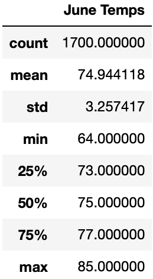
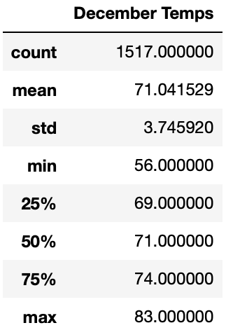

# Surf’s Up!

## Overview
Oahu boasts some of the finest surfing destinations on the planet. If surfing isn’t your thing, maybe you just haven’t tried it yet! Oahu still offers up gorgeous beaches, luscious foliage, and killer cuisine.

The purpose of this analysis is to analyze temperature trends In Oahu to support our proposal for a surf and ice cream shop. To ensure our surf and ice cream spot in Oahu will flourish, we have queried temperature data to assess whether… the weather supports our efforts!

## Results
### June

 - As expected, June is noticeably warmer than December. 
 - The mean temperature of 74.94 degrees (F) bodes well for lovers of both surfing and ice cream. While the maximum temperature of 85 degrees is still quite comfortable for surfing, a minimum temperature of 64 degrees may deter some. 
 - Avid surfers will still be out in full force in June!

### December

 - December, while quite chilly, still records a mean temperature of 71.04 degrees (F). 
 - The maximum recorded temperature of 83 degrees nearly rivals those recorded in June. 
 - While we can expect a slower season, operations will not need to halt entirely in December, barring an unusually cold storm rolling through.

## Summary
All in all, some colder months may indicate a slower tourism season despite locals and avid surfers frequenting beaches on Oahu. As we can see from our analysis, December can yield cooler temperatures than warmer months such as June, but the temperatures on beautiful Oahu are rarely glacial.

## Recommendations
I would recommend querying this same analysis for each month of the year to determine if temperature data from each month in Oahu are documented as we assume. Perhaps January actually tends colder than December. August might yield slightly higher temperatures than June. Understanding how each month and season stacks up against the others may assist us in anticipating seasonal fluctuations and allow us to prepare specialized services to drive business during slow seasons.

Similarly, I believe querying the precipitation data for each month would provide a strategic boon. Higher precipitation levels may impact business and understanding trends will allow us to further anticipate slower seasons or assist us in understanding the needs of our customers during high humidity and high precipitation seasons. 

Lastly, reviewing the same data for other Hawaiian Islands may tell us the whole story. Is Oahu the best fit for surfing and ice cream? We think so, however understanding the whole picture may change our minds!
